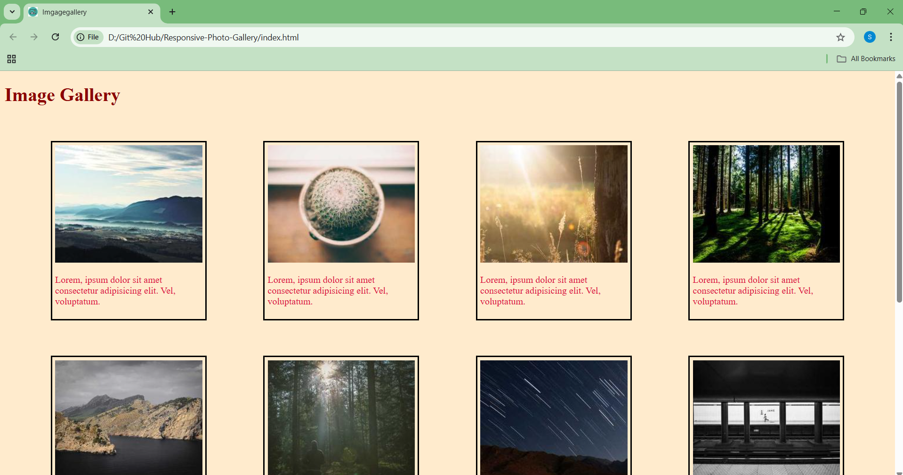
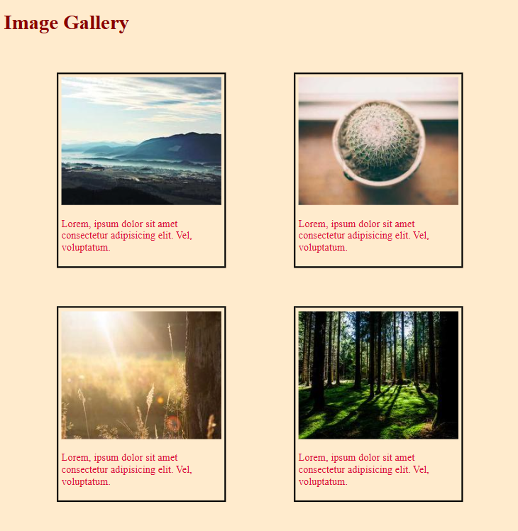

# Responsive Photo Gallery

A simple **HTML and CSS** project to create a **responsive Photo gallery**. The gallery adapts to different screen sizes and devices, making it look great on desktops, tablets, and mobile phones.

## Features

- Fully responsive layout using **CSS Flexbox/Grid**
- Hover effects on images
- Simple and lightweight – no JavaScript required
- Easy to customize and extend
- Works across modern browsers

## Output

Here are the screenshots of my project:

 

  


## Installation

1. Clone the repository:
   ```bash
   git clone https://github.com/yourusername/responsive-image-gallery.git
